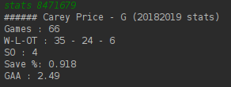
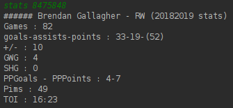

# HelloNHL

Simple script based on the **NHL Stats API** to display information and stats about NHL seasons, teams, players and draft.

Thanks to Drew Hynes for the great documentation : https://gitlab.com/dword4/nhlapi/blob/master/stats-api.md

Calls w/ some examples :

*_help_*

*_today_*

*_standings_*

*_teams_*

*_roster_*

*_standings_*

*_stats_*

*_draft_*

